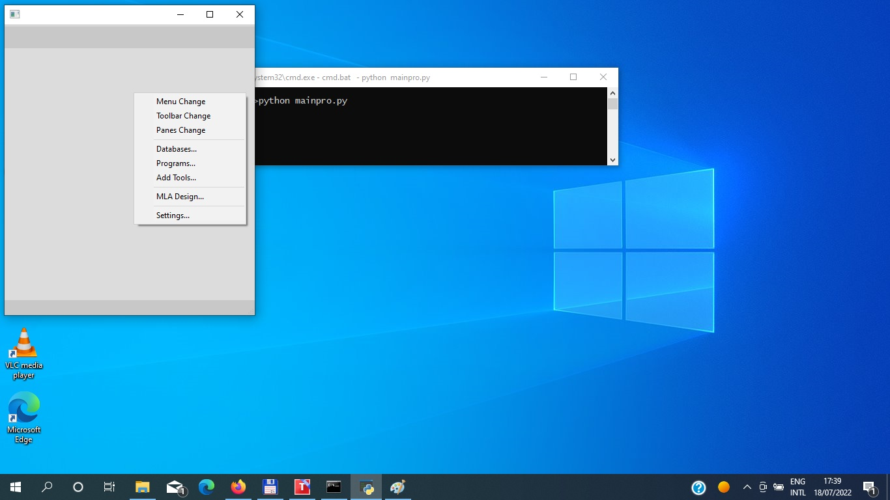

# MPT5
## This Project is a platform for make application  with simple  GUI  and developable application 
### you can use python source code , database and Machine learning algorithms together in one place

Start from the beginning with your own and others' codes



Introduction
===========
This is a new idea for made an application and develop base on GUI and Relation between components,
you can start work and change for each Time, each Position, each Conditions, with or without other, at your likely style.
Also you can Test your own code with use own Machine Learning Algorithm codes for own Data and Dataset for own Design.
If you help us , all of this project can change in other computer language , other GUI interface , other option and tools and ...  
If you sponsor to us , we can write for you at your own design on this idea base.


Start
-----
Befor Use Project ensure that ``python 3.7+`` and ``wxpython`` package install on your system .  
you can see requirement package in file text . this project start from scerach 
if you like use Database engain same as MySQL or Oracel ... please install package you need  
and if you like use from other package like SQLalchemy Please send us request


Installation
------------
Please type in shell this command

```shell
pip install Temp5
```

after install you can see in Scripts TEMP5.py file
you can use it to make a directory and app in hard disk by
```shell
python TEMP5.py Create c:\New_Dir\Your_Project_Path\
```
after install change directory to your project and type
```shell
python -m Mainpro
```
or 
```shell
python Mainpro.py
```


Appearance of the application
-----------------------------

---------------------
  * Menu and Menubar  
     you can create , edit and delete [Menu Bar](docs/Help/MenuBar.md) and [Menu Item](docs/Help/MenuItem.md)
     Also you can Create [Sub Menu](docs/Help/SubMenu.md) as same as Menu Item 
---------------------
  
  * Toolbar  
    You can Add Edit and Delete [Toolbar](docs/Help/ToolBar.md) with Icon to your application

---------------------
  * Panes  
    You can Design or placed [Pane](docs/Help/Panes.md) in your application
---------------------
  

New Program (How to add)
------------------------

 1. How Connect each [program](docs/Help/Programs.md) to each items
 2. Relationship with [database](docs/Help/Databases.md)

Design Database
---------------

 * Select your engein type in [setting](docs/Help/Setting.md) part 3
 * Creating a table and using it according to the [database](docs/Help/Databases.md) guide


Add from another source code
----------------------------

* Upload and Create Package in [AddTool](docs/Help/AddTool.md)
* Downloads and Unpack in [AddTool](docs/Help/AddTool.md)


Machine Learning
----------------

1. Design a Panel in [Machine Learning Design](docs/Help/ML.md)
2. Add Algorithm in [Machine Learning Design](docs/Help/ML.md)
3. Connect to Data in [Machine Learning Design](docs/Help/ML.md)
4. Perview Computing in [Machine Learning Design](docs/Help/ML.md)

Example
=======
In below you can see some of Example application that you can create by MPT5

* [Quit program](example/Quit/Help.md)
* [Calculator]()
* [Calendar1]()
* [Calendar2]()
* [Clock]()
* [Webcam]()

Overview
========
This project is a multiple environment with the ability to develop and change, allowing you to test different algorithms in open source
At the same time, you can easily and quickly change the graphic design of the program and use different languages in it
The algorithm part is independent and receiving its results does not affect the principle of the program, so you can choose the best model for your data.
Overall, a suitable program for testing and training and testing machine learning models

Contact to us
==========
If you like more info about this project or like to change or have a problem send to this address:  
srcfount14@gmail.com


