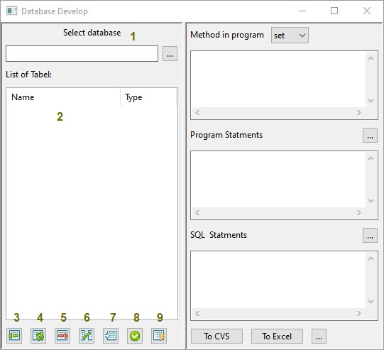
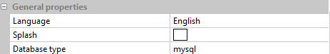
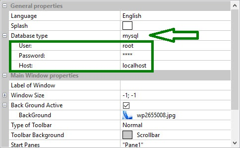
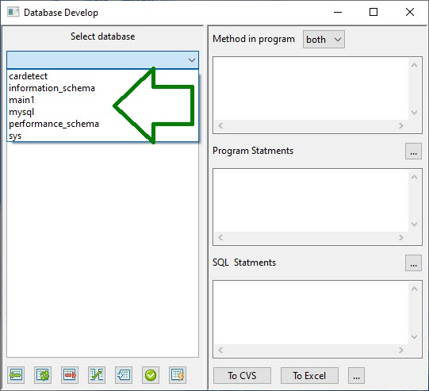
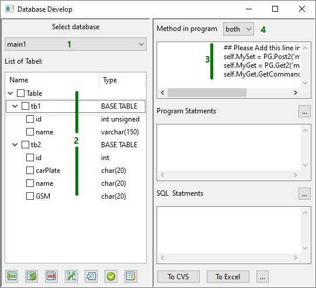
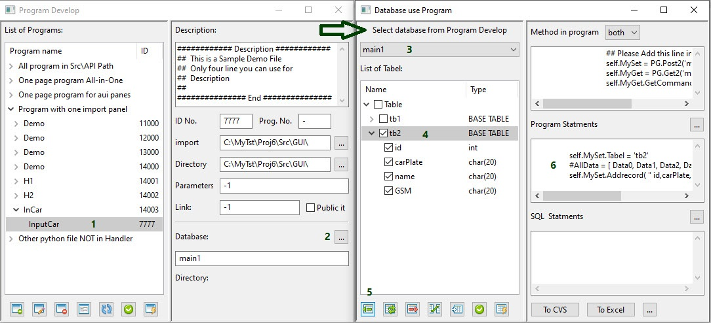
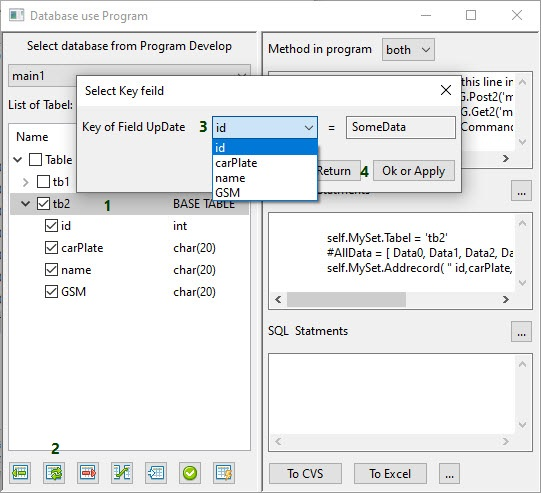
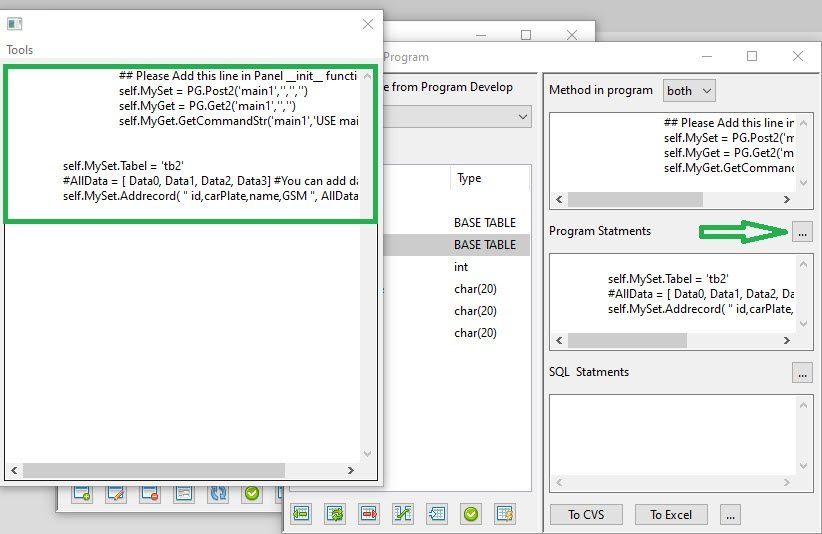
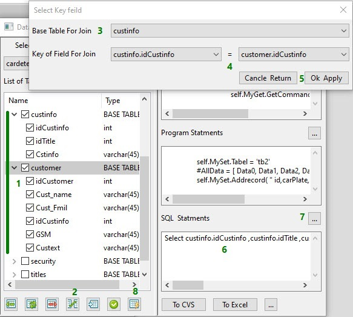

How Use Database in Programs
============================
In this window you can see how add code to program and access to database  
Also you can brows Table of Database and schema of each Table
you can export data to csv and excel file and use it in other part

if your database type is SQlite in setting:

1. choise database file
2. list of Tables
3. Insert to Table that select (Show in Program Statements)
4. Update Table that select (Show in Program Statements)
5. Delete Table that select (Show in Program Statements)
6. Join two or more Table that select (Show in SQL Statements)
7. Browes Table
8. apply to program
9. generate a SQL file

if your database type is other type in setting:

> note : you must enter User Password and Host then press apply  
> please attention to set correct information to join to database  
> application use a default port for connect database 

if connect have not any error You should see a choice menu instead of a file selection

How use Database in programs
----------------------------

1. Select Database(or open sqlite database)
2. you can see Tables and fields
3. This part must add to your program
4. you can use `Set` or `Get` or `Both`

> Note: If you open Database Develop from Program Develop
> program Automatic add this line to source of your python file

> if you used database in your python program you can see it in program develop in future 

1. Select program
2. If used you see or use new press [...]
3. System automatic show database
4. Select Table you like to use
5. press Insert button
6. see to line you must add to program 

> please attention to arrow when you open database from program

if press Update button:

1. Select Table you work with it
2. Press Update button
3. Choice Key field to filter data 
4. press OK or Apply button

> Same Do for Delete 

Arrow showing  button that you can press to see all statement you must enter in program file

> It is your responsibility to observe the distance between the tabs

How to Join two or More Table
-----------------------------

1. Select Tables you like join it
2. press Join button
3. Choice Base Table 
4. Choise Key of Field for Join
5. press Ok Apply to Create Statement SQL
6. You can see SQL Here
7. This button save your statement to SQL file in Path Src\DBF\sqls

