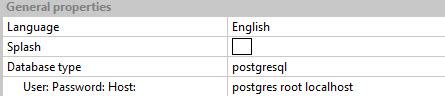
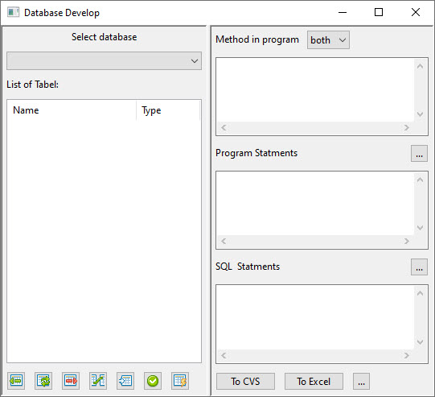

How Use Database in Programs
============================
In this window you can see how add code to program and access to database  
Also you can brows Table of Database and schema of each Table
you can export data to csv and excel file and use it in other part

if your database type is SQlite in setting:

1. choise database file
2. list of Tables
3. Insert to Table that select (Show in Program Statements)
4. Update Table that select (Show in Program Statements)
5. Delete Table that select (Show in Program Statements)
6. Join two or more Table that select (Show in SQL Statements)
7. Browes Table
8. apply to program
9. generate a SQL file

if your database type is other type in setting:

> note : you must enter User Password and Host with space between them

if connect have not any error You should see a choice menu instead of a file selection

