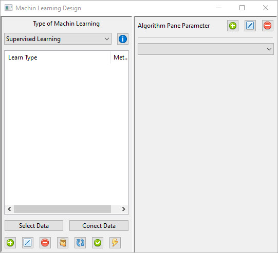
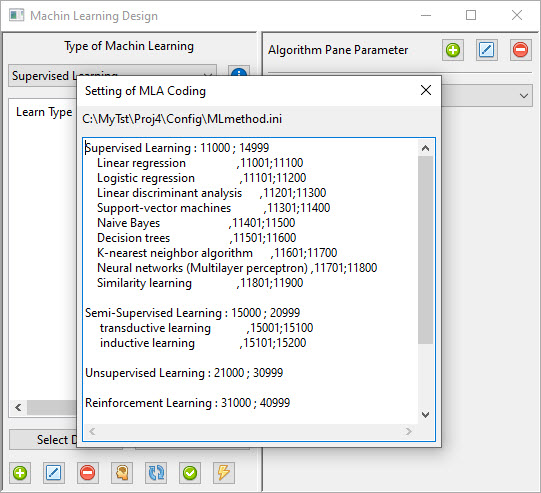

How to Use Machine Learning in Application
==========================================

Machine Learning have two part and in each you can use source code 
1. Algorithm Part, that you can use scripts and programs to comput mamthmatic formula
2. In Panel Part that you can design it for define or change parameter, show plot, set data and ...

each part have a special path to get source file in it 
MLA in Src Path for Algorithm and MLP for Panel.  
you can also change Classification of Algorithm codes you can see it in MLmethod.ini file  

