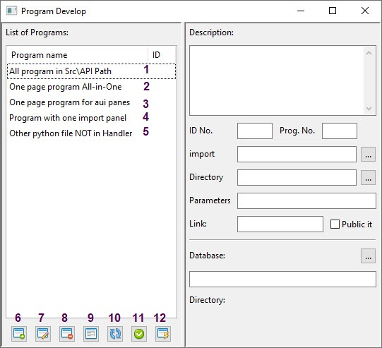
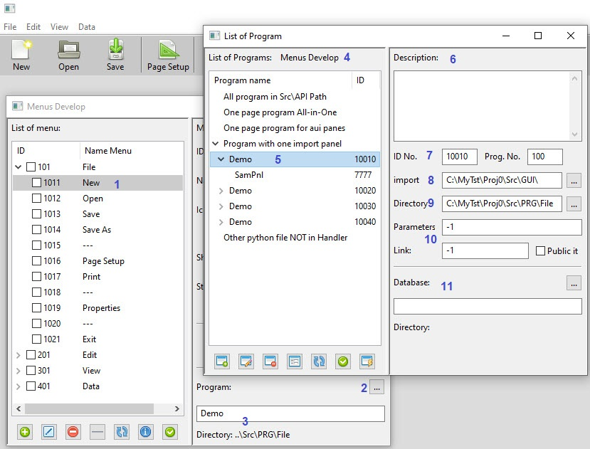

How to Work Programs and Codes
===========================

If you execute from menu you can not connect any program to any menuitem or toolbar item ,
But if you execute it from Menus Develop or Tool Bar Develop or Panes 
you can see program that connect to item and can change program.
Only one time you can execute this window from Develops part 

> Note:  
if field program was empty in Menu Develop or Toolbar Develop , list of program **NOT** work.  
if you wrote a mistake program or name had error, please type ``Demo`` in field and then press __Edit__ Button.

Orginal window is this:

1. All file in ``Src\API`` path show here. this script maybe import with other script
2. if file have a main function and GUI frame and panel inside it will show here
3. all AUI Panes source code or Panel with code start 5 number will show here
4. main program of menu and toolbar placed in Path ``Src\PRG`` will show here
5. other file that not in handler but exist in ``PRG AUI GUI`` path will show here 
6. Add a new program, Editor window will open
7. If select a item you can open and Edit it 
8. delete item from list or handler also you can delete from hardDisk
9. you can preview item that connect to menu or toolbar
10. refresh and update the list
11. if you come from menu or toolbar or pane , apply to select program for that part
12. generat a source that not in handler 

When you come from Menu Develop window:

1. Select your menu that to change or see its program
2. press button to appearance List of Program
3. if attend to file name and path and exist file list automatic select it
4. in the top of window write which program open it
5. file selected and code start at 10010+
6. if file have a Desciription will show here
7. ID number and program number
8. path of import file that use
9. path of file
10. this part not work for (We predicted for the future )
11. if program use database show here

How Add a new Program
---------------------

