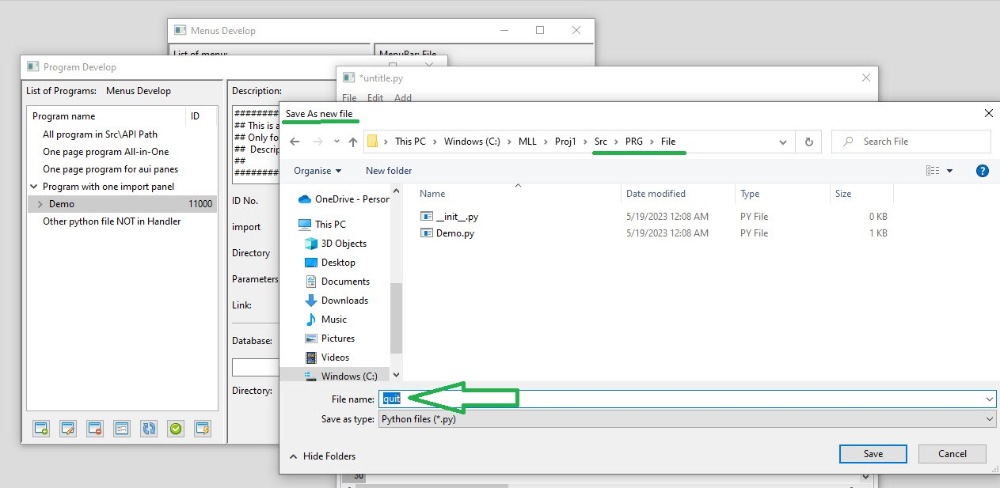

# How add quit to appliaction

1. In first make a [Menu Bar](docs/Help/MenuBar.md) and  [Menu Item](docs/Help/MenuItem.md) or [Toolbar](docs/Help/ToolBar.md) 
2. Add "Quit" ot "Exit" or other name you like as item  
3. Go to Programs list for Change Demo to quit.py

4. Add new untitle.py   

5. copy source from example and save as quit.py 

6. Also you can change this code if you like 

7. refresh and generate [program](docs/Help/Programs.md) code 

8. edit item and restart app and test your action 

